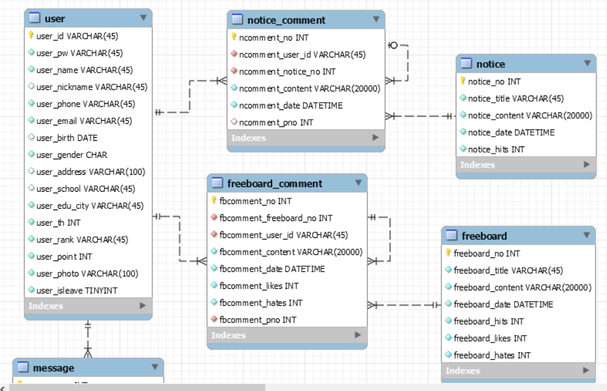

##원피스 프로젝트

### 팀명 : 원피스

### 팀원 : 박주성 전의환 박민형 이호빈 정용현 송민재

### 프로젝트 명 : SSAFY 커뮤니티 사이트 SSAFY&S

#### 2019-05-08

##### 요구사항 정의 / 웹 사이트 디자인

- 요구사항 정의

	1. 기능적 요구사항

    (1) 회원관리

		- 사용자는 회원가입 / 탈퇴 / 로그인 / 로그아웃을 할 수 있다.

		- 회원가입을 할 때 SSAFY 회원임을 인증해야 한다.
			- 사피 명찰 찍어 올리기?

		- 회원을 기수별로 구분해서 보여준다.

		- 하루 방문자 수와 총 방문자 수를 보여준다.

	(2) 게시판 관리
    
    	- 웹 사이트에는 익명 자유게시판이 존재한다.

		- 취업 / 스터디 / 팁게
		
        - 실시간 채팅

	2. 전체 계획
	
	(1) 총 가능 시간 : 5. 12 ~ 6. 16	(약 30일)
    	- 최종 목표 : 회원관리, 익명 자유게시판 완성 / UI 완벽

		- 12일 : 요구사항 완료 / DB 설계

		- 13일 ~ 26 : 회원관리	/ 20,21 만나기

		- 27 ~ 9 : 게시판 완성

		- 9일부터 : 보완 / 마무리
	
    (2) 역할
    	- front : 의환 / 용현

		- back : 민재 / 민형 / 호빈

		- db 서버 : 주성

#### 2019-05-12

##### 사이트 디자인 시안 / DB 모델링

- 모델링

- 웹사이트 디자인

